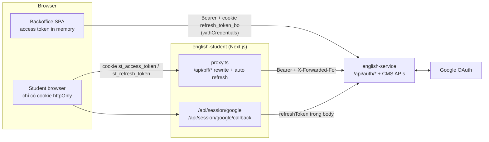
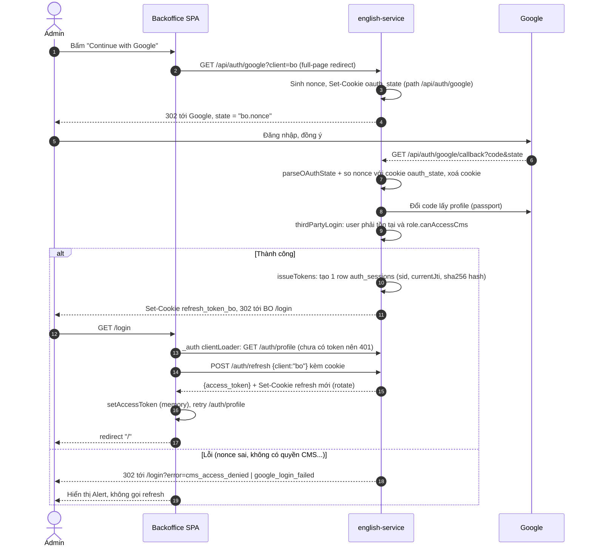
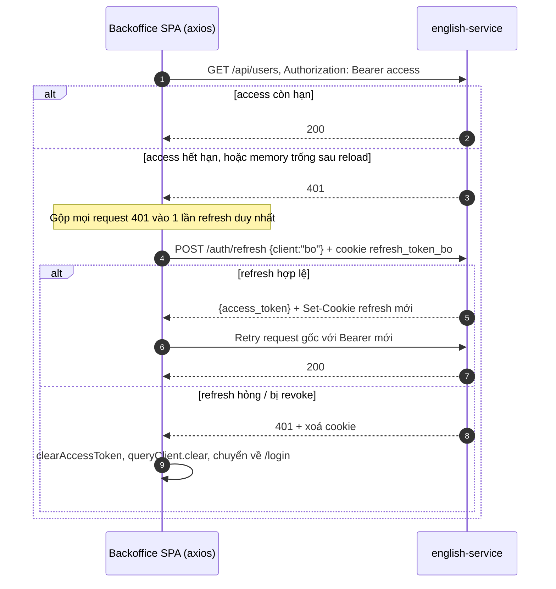
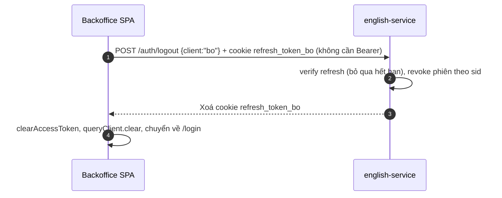
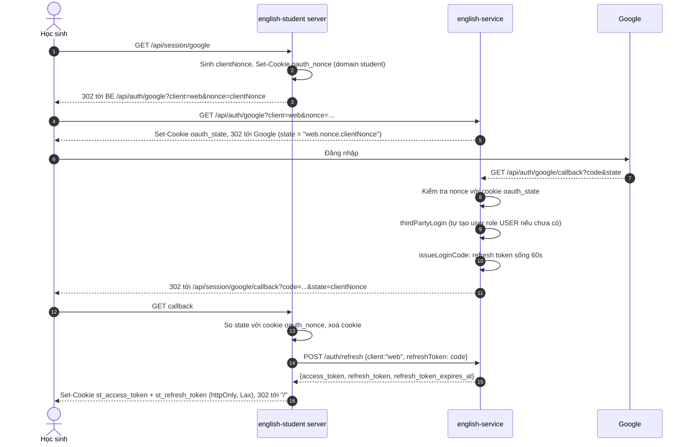
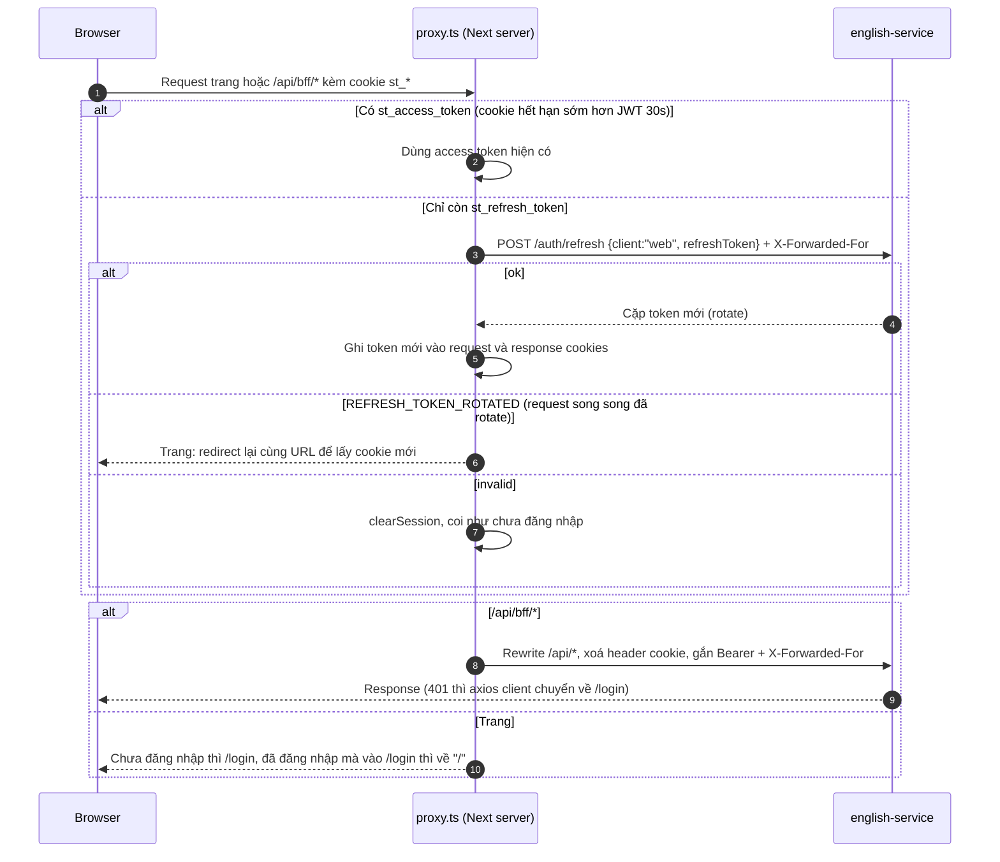
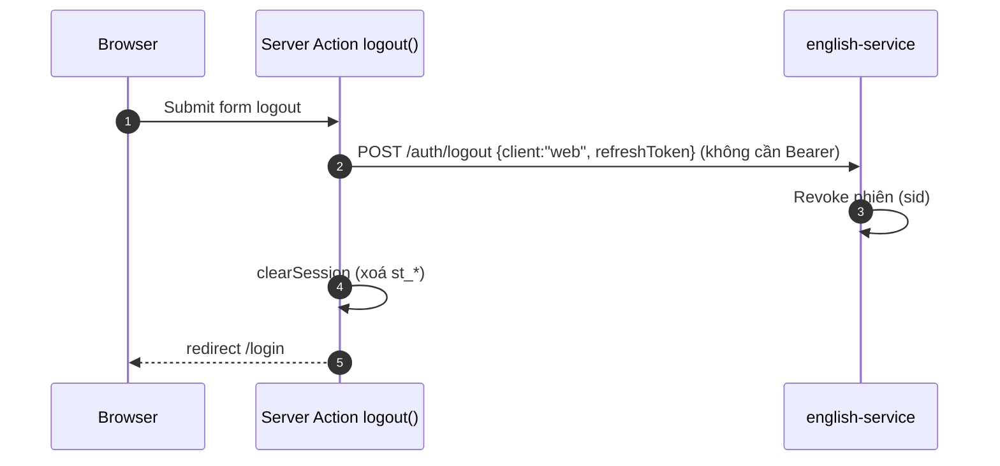
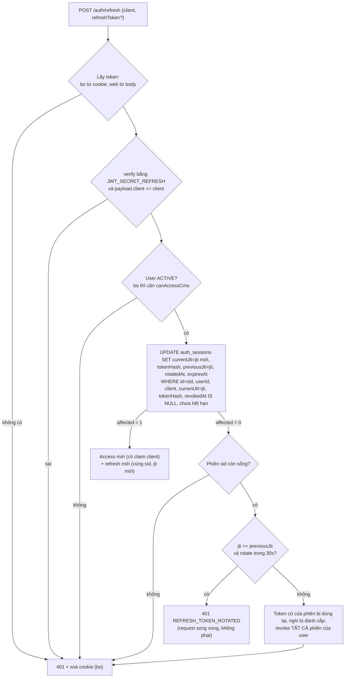

# Luồng xác thực (Auth flow)

Tài liệu mô tả luồng xác thực giữa **english-service** (BE), **english-backoffice** (BO, React SPA) và **english-student** (Next.js, server đóng vai trò BFF).

|                     | Backoffice (`client = bo`)                                                                    | Student (`client = web`)                                                             |
| ------------------- | --------------------------------------------------------------------------------------------- | ------------------------------------------------------------------------------------ |
| Access token        | Trong **memory** của SPA, gửi qua header `Authorization: Bearer`                              | Cookie httpOnly `st_access_token` trên domain student. BFF gắn Bearer khi gọi BE     |
| Refresh token       | Cookie httpOnly `refresh_token_bo` do **BE** set (path `/api/auth`, `SameSite=Lax`, `Secure`) | Cookie httpOnly `st_refresh_token` trên domain student. BFF gửi lại trong **body**   |
| Google login trả về | BE set cookie refresh rồi redirect về `/login`                                                | BE redirect kèm `?code=` (refresh token sống 60s, dùng 1 lần) và `state=clientNonce` |
| Chống login CSRF    | Cookie `oauth_state` trên domain API                                                          | `oauth_state` (API) + `oauth_nonce` (domain student)                                 |
| Endpoint CMS        | Được gọi (`@Clients(AuthClient.BO)`)                                                          | Bị 403                                                                               |

## 1. Tổng quan

Guard chain của BE cho mọi request: `ThrottlerGuard` → `JwtAuthGuard` (bỏ qua nếu `@Public`) → `PermissionGuard` (`@Clients` + `@CheckPermissions`, mặc định deny).

## 2. Backoffice

### 2.1 Đăng nhập Google

### 2.2 Gọi API, access token hết hạn, reload trang

### 2.3 Đăng xuất

## 3. Student (Next.js BFF)

### 3.1 Đăng nhập Google

### 3.2 Gọi API qua BFF và refresh tự động

### 3.3 Đăng xuất

## 4. Xoay vòng refresh token (`POST /auth/refresh`)

